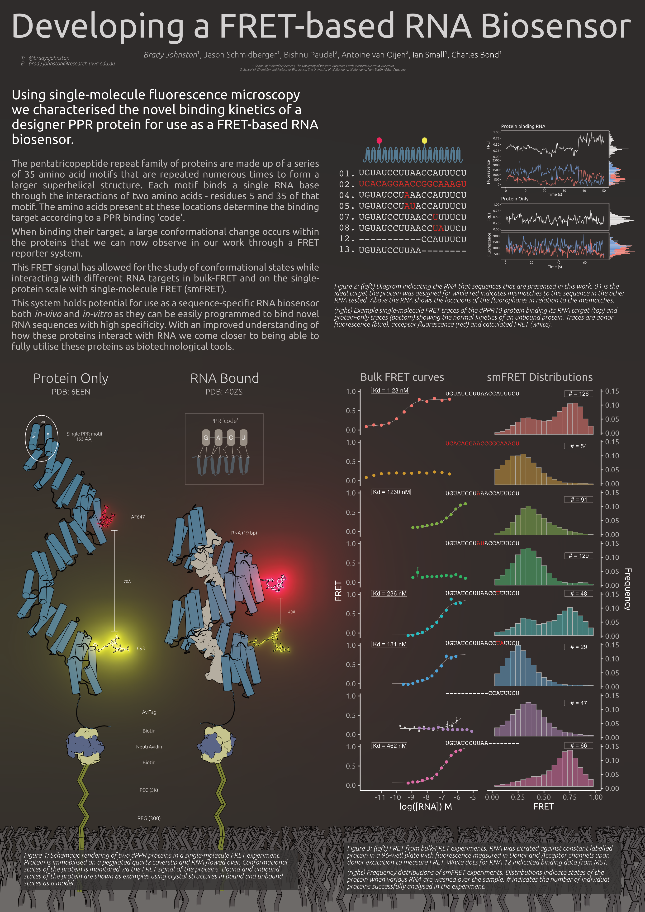
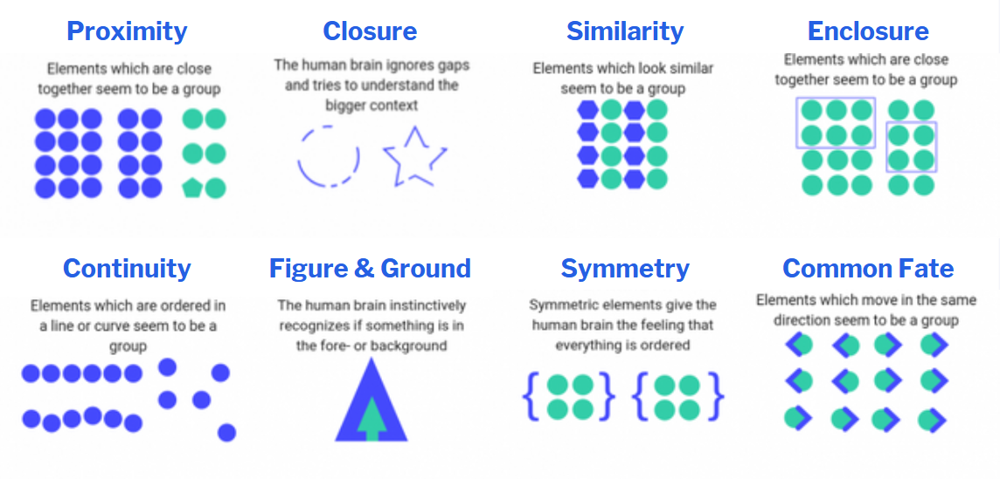
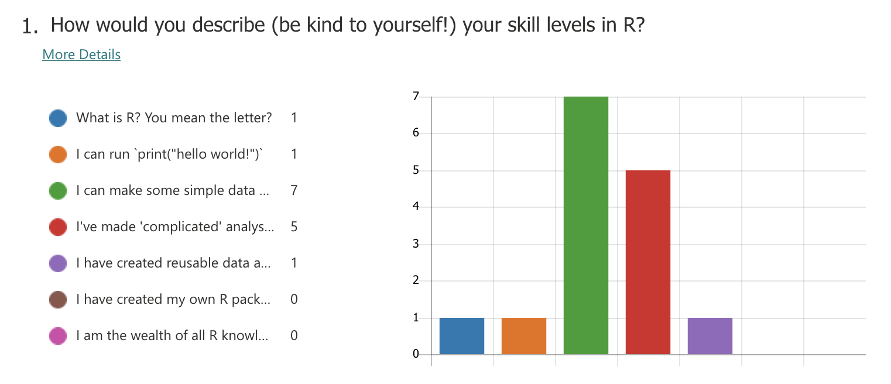
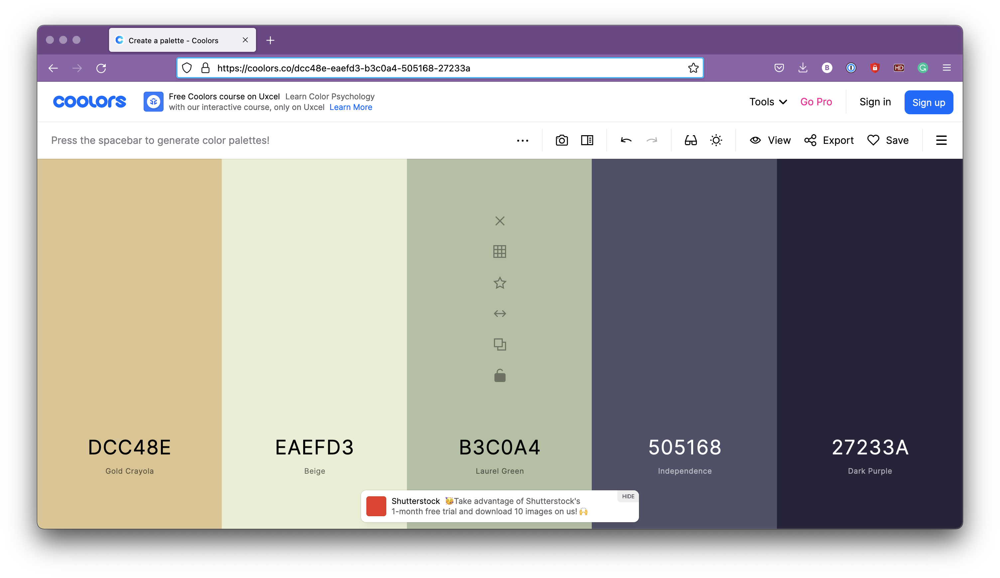
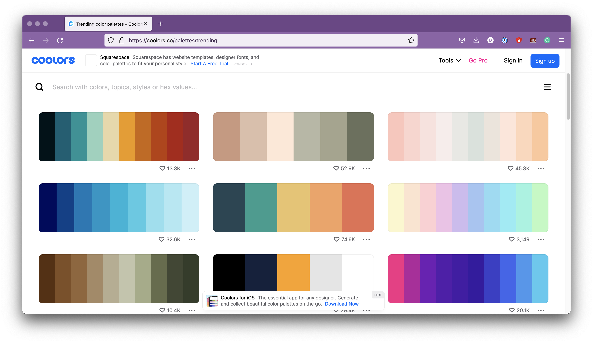
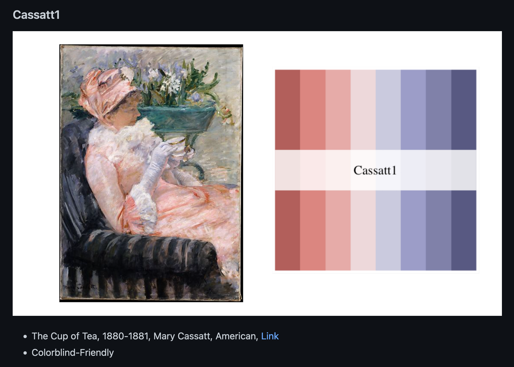

```{r setup, include=FALSE}
options(htmltools.dir.version = FALSE)
knitr::opts_chunk$set(
  fig.width=9, fig.height=3.5, fig.retina=3,
  out.width = "100%",
  cache = FALSE,
  echo = TRUE,
  message = FALSE, 
  warning = FALSE,
  hiline = TRUE
)

library(tidyverse)
```

```{r xaringan-themer, include=FALSE, warning=FALSE}
library(xaringanthemer)
style_duo_accent(
  primary_color = "#6dc0d5",
  secondary_color = "#8cdfd6",
  inverse_header_color = "#FFFFFF"
)
```

```{css, echo=FALSE, eval=TRUE}
.highlight {
  color: #AD7a99
}
.bold-black {
  color: black
  font-weight: bold
}
.remark-code{line-height: 1.5; font-size: 60%}
@media print {
  .has-continuation {
    display: block;
  }
}
```


.pull-left[
# Who am I?

- Writing Thesis in Structural Biology  
</br>
- Par-time data scientist at the Minderoo Foundation
</br>

- Very interested in all things data-viz

Twitter: [@bradyajohnston](https://twitter.com/bradyajohnston)

<iframe src="https://molstar.org/viewer/?pdb=4ozs&hide-controls=1" width="100%" height="250px" frameBorder="0"></iframe>
]
.pull-right[
<center>

]

---
# Who am I?
.left-column[

- Writing Thesis in Structural Biology  
</br>
- Par-time data scientist at the Minderoo Foundation
</br>

- Very interested in all things data-viz

Twitter: [@bradyajohnston](https://twitter.com/bradyajohnston)

]
.right-column[
<center>
<middle>
<video width="100%"  autoplay loop>
  <source src="https://thumbs.gfycat.com/JointSlimyAidi-mobile.mp4" type="video/mp4">
</video>
]

---
class: center, middle
## R Knowledge Rollercoaster


.pull-right[
###### [@allisonhorst](https://twitter.com/allisonhorst)
]

---
class:

## Come Along to `Hacky Hour`!

.pull-left[
> **2-4 pm on Tuesdays**, in person at Hacket Cafe

> All skill levels welcome. Beginners encouraged!

<center>
]

.pull-right[
<a class="twitter-timeline" data-width="100%" data-height="450" data-theme="light" href="https://twitter.com/HackyHourUWA?ref_src=twsrc%5Etfw">Tweets by HackyHourUWA</a> <script async src="https://platform.twitter.com/widgets.js" charset="utf-8"></script> 
]

---
class: middle
## What Makes a Good Figure?

.pull-left[

-  Does not misrepresent the data.

- Tells a clear story
  - Straightforward message, easy to read, hard to misinterpret.

- Low cognitive load.
 - The less thinking the better
 - `low_cognitive_load != less_data`

- Accessible
  - Colourblind-friendly, good contrast, accesible font choices
  - Accessible jargon & language choices
]

.pull-right[

]


---

## Data Viz Principles - Understanding the Context
.pull-left[

- ###  WHO
  - Who is the audience?

- ###  WHAT
  - What do you need them to know?

- ###  HOW
  - How are you going to communicate your point?
]
.pull-right[
<middle><center>
]

---

## WHO


 - What is their familiarity with the topic?  
  - Experts in your field, experts not in your field, undergrads, 
  general public


 
 - How much time to do you have?  
  - Published in a paper, in a 5 / 10 / 40 minute talk, a poster


 - Do you need to establish trust?
  - Explain technique? Show previous work?

 -  What is your relationship to them?
  - Lab meeting, school presentation, presentation to public

---
## Design and Data

#### Good design _reduces_ the cognitive load.

--

>Cognitive load refers to the amount of effort that is exerted or required while
reasoning and thinking. Any mental process, from memory to perception to
language, creates a cognitive load because it requires energy and effort. When
cognitive load is high, thought processes are potentially interfered with.

>_- Interaction Design Foundation_

--

</br>
#### The more you have to .highlight[think] about a figure, the higher the cognitive load.

---
class: center, middle

 
 
 
---

## Gestalt Principle

- Pre-processing of the information that the brain uses
</br>
- Use these principles to create an _information-heirachy_.
</br>
</br>

<center>
<middle>

</center>
</middle>
 
 

---
## Reducing Cognitive Load




---

## A Slightly Cleaner Example

```{r forms-example, echo = FALSE, fig.height=4.5}
df <- readxl::read_xlsx("data/form_responses.xlsx")

answer_levels <- c(
  "What is R? You mean the letter?", 
  'I can run `print("hello world!")`', 
  'I can make some simple data analysis scripts.',
  "I've made 'complicated' analysis scripts.",
  "I have created reusable data analysis scripts, for different data sets.",
  "I have created my own R packages.",
  "I am the wealth of all R knowledge, Hadley Wickham asks me perosnally for advice on his pacakges."
)
```


```{r forms-example-plot, echo = FALSE, fig.height=4.5}
df %>% 
  select(ID, `How would you describe (be kind to yourself!) your skill levels in R?`) %>% 
  rename(
    answer = 2
  ) %>% 
  mutate(
    answer = factor(answer, levels = answer_levels), 
  ) %>% 
  group_by(answer) %>% 
  count(answer, .drop = FALSE) %>% 
  ggplot(aes(x = n, y = answer, fill = answer)) + 
  guides(fill = "none") +
  geom_col() +
  scale_y_discrete(
    breaks = answer_levels, 
    labels = str_wrap(answer_levels, 50)
  ) + 
  scale_x_continuous(
    expand = expansion(mult = c(0, 0.1)), 
    breaks = c(0, 2, 4, 6)
  ) +
  labs(
    y = "", 
    x = "", 
    title = "1. How would you describe (be kind to yourself!) your skill levels in R?"
    ) + 
  scale_fill_manual(values = MetBrewer::met.brewer(MetBrewer::colorblind_palettes[4], 7)) + 
  theme_classic(base_size = 13) +
  geom_text(aes(label = n, x = n + 0.2), size = 5) + 
  theme(
    plot.title.position = "plot",
    axis.text.y = element_text(hjust = 0, size = 9), 
    axis.ticks.y = element_blank()
  )
```

---

`r flipbookr::chunk_reveal(chunk_name = "forms-example-plot", title = "## How did I do it?")`


---
class: inverse, center, middle

# Data and Design Resources

---

## Which plot to choose?

[R Graph Gallery](https://www.r-graph-gallery.com/ggplot2-package.html) (My go-to when starting)

<iframe src="https://www.r-graph-gallery.com/index.html#portfolio_landing" width="90%" height="450px" frameBorder="0"></iframe>
---
## Which plot to choose?

Find inspiration on twitter ([#tidytuesday](https://twitter.com/search?q=%23tidytuesday&src=typed_query)), follow blogs, in other papers.

<div class="taggbox-container" style="width:100%;height:100%;overflow: auto;"><div class="taggbox-socialwall" data-wall-id="85017" view-url="https://widget.taggbox.com/85017"></div><script src="https://widget.taggbox.com/embed.min.js" type="text/javascript"></script></div>
---
## What Colours to Choose?

Generate your own colour palettes with [Coolors.co](https://coolors.co)

<center></center>

---
## What Colours to Choose?

Find other popular colour paletters on [Coolors.co](https://Coolors.co)

<center></center>

---
## What Colours to Choose?

Lots of colour palette generating R packages.
.pull-left[
[`{fishualize}`](https://nschiett.github.io/fishualize/index.html)
<iframe src="https://nschiett.github.io/fishualize/index.html" width="100%" height="400px" frameBorder="0"></iframe>
]
.pull-right[
[`{MetBrewer}`](https://github.com/BlakeRMills/MetBrewer)


]

---
class: inverse, center, middle

# Getting Into The Code
_Lets make some plots._


---

# General `{ggplot2}` tips

If you are still learning you way around `{ggplot2}`, then use [`{esquisse}`](https://dreamrs.github.io/esquisse/)!
<center>


---


---
## Assemble Whole Figures
.pull-left[

- Stitch together multiple plots, into one figure. [`{Patchwork}`](https://patchwork.data-imaginist.com/) takes care of the alignments, lettering and layout.

- _Just Works_.

- Alternatives: [`{cowplot}`](https://wilkelab.org/cowplot/)
]
.pull-right[

<middle><center>

###### [@allisonhorst](https://twitter.com/allisonhorst)
]


```{r, echo=FALSE}
library(flipbookr)
```

```{r test-plot, fig.height=5, include=FALSE}
library(patchwork)
library(ggplot2)

ggplot(mtcars, aes(mpg, wt, colour = factor(cyl))) + 
  geom_point() + 
  theme_classic() + 
  labs(title = "Some title goes here") + 
  labs(
    x = "Miles per Gallon", 
    y = "Weight (kg)"
  ) -> p1

ggplot(mtcars, aes(cyl, fill = factor(cyl))) + 
  geom_bar() + 
  theme_classic() + 
  labs(title = "A title here as well") + 
  labs(x = "Engine Cylinders") -> p2

wrap_plots(p1, p2) + 
  plot_layout(guides = "collect") + 
  plot_annotation(
    tag_levels = "A", 
    tag_suffix = ")"
  )

```

---
  
  `r chunk_reveal(chunk_name = "test-plot", title = "## Assembling Plots")`

```{r patchwork2, include=FALSE, fig.height=5}
wrap_plots(p1, p2) + 
  plot_layout(guides = "collect") + 
  plot_layout(design = "A##B") +
  plot_layout(ncol = 1)
```

---
  
  `r chunk_reveal(chunk_name = "patchwork2", title = "## Controlling the Layout")`


---
## What can you {ggplot2} do?

Have a look at https://exts.ggplot2.tidyverse.org/gallery/

<iframe src="https://exts.ggplot2.tidyverse.org/gallery/" width="100%" height="450px" borderColor="0"><iframe>
---
List of packages
- patchwork
- fishualize
- ggsegment
- 


